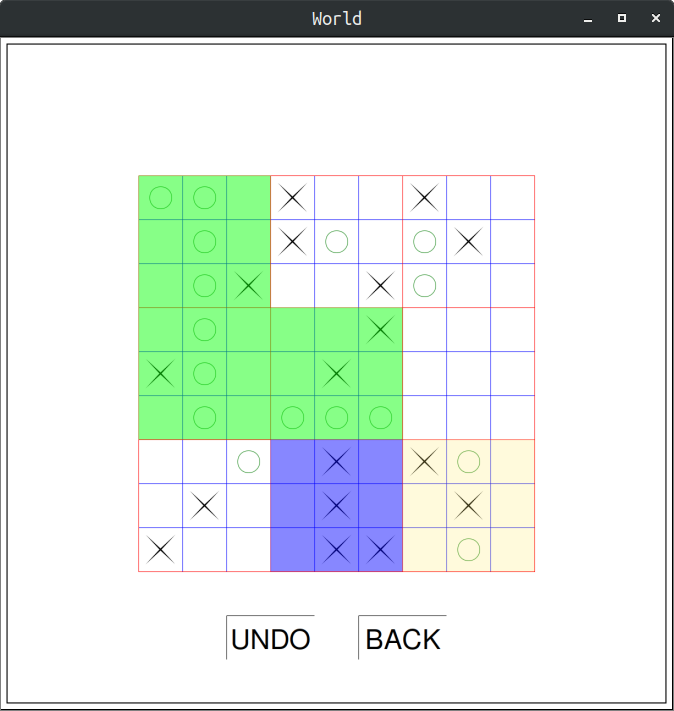
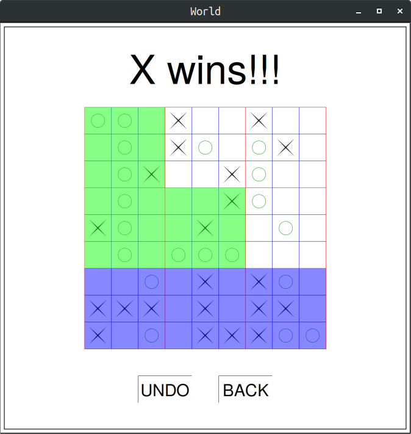

# Ultimate Tic Tac Toe

## Game Desciption
Ultimate/Strategic Tic-Tac-Toe is a board game composed of nine tic-tac-toe
boards arranged in a 3-by-3 grid. Players take turns playing in the
smaller tic-tac-toe boards until one of them wins in the larger tic-tac-toe
board. Compared to traditional tic-tac-toe, strategy in this game is conceptually more difficult, and has proven more challenging for
computers. For more details, click [here](https://en.wikipedia.org/wiki/Ultimate_tic-tac-toe).

## GUI
The game has been developed in the Racket programming language. 
We have used the 2htdp/universe and 2htdp/image libraries to
implement the GUI of our game. The GUI includes a 9 set of 3x3 boards
and the individual boards are coloured depicting who has won that board
and the board on which the move has to played is coloured yellow.

## AI for single player mode
For making the AI in single player mode, we have implemented the
<b>Monte-Carlo Tree Search</b> algorithm to generate partial branches of the
game tree. The Monte Carlo tree-search relies on random simulations of
games in order to determine how good a position is. The tree has been
constructed using a general node structure and each node is a state in
which the game can be and it's kids are a list of possible states that can
be generated by playing any move on the current state. When the
computer has to finally play a move, it applies the UCT formula on each
branch to find the best move available.
The UCT formula used is -

where

- <i>w</i>i stands for the number of wins for the node considered after the i-th move
- <i>n</i>i stands for the number of simulations for the node considered after the i-th move
- <i>N</i>i stands for the total number of simulations after the i-th move run by the parent node of the one considered
- <i>c</i> is the exploration parameter—theoretically equal to √2; in practice usually chosen empirically

## Snapshots

---

---

---

## Limitations
For the one-player version, the AI is not as efficient as one would like it
to be. We couldn’t keep the depth of the tree search sufficient enough as it lead to a substantial increase in the computation
time. Next step would be to train the AI beforehand and save it instead of running hundreds of simulations during the game.  
The game tree has been constructed using purely random simulations to
decide whether a given move is favourable or not. We were not able to
design heuristics for the game, which would have increased the
efficiency of decision-making, due to the complexity of the game.

---

#### Developed by Mohammad Taufeeque, Utkarsh Agarwal and Arjun Kashettiwar

---
